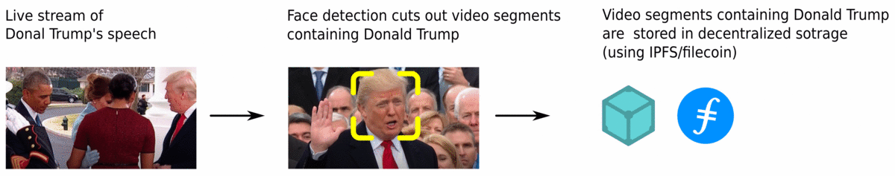

# Speech Archivator
**Speech Archivator** deals with problems emerging from [deepfake](https://en.wikipedia.org/wiki/Deepfake) technology. 
Advances in deepfake technology made it possible to manipulate or generate visual and audio content with a high potential to deceive.
While this is a fascinating technology, it is also dangerous. 
Political (and other) powers can misuse this technology to create fake videos that are indistinguishable from the real ones. Such videos will cause false beliefs and opinions, just like typical fake news do. 

The ultimate goal of **Speech Archivator** is to watch out for live stream videos that include speeches of persons that have a high impact on society. 
We use an artificial neural network to detect faces in the video.
The video segments containing specific persons are then uploaded to safe decentralized storage such as [IPFS](https://ipfs.io/), where it can't be manipulated and anyone can always retrieve the original video.  

#### Example


> This project was created during [HackFS hackathon](https://hackfs.com/) 
> organized by [ETH Global](https://ethglobal.co/).

# video-presence-tracker

A set of Python scripts for cutting out segments from videos containing specified faces.
These segments can be uploaded to the [IPFS](https://ipfs.io/) using the ```ipfs_uploader.py```.
The system uses face detection and face recognition implemented in PyTorch.

